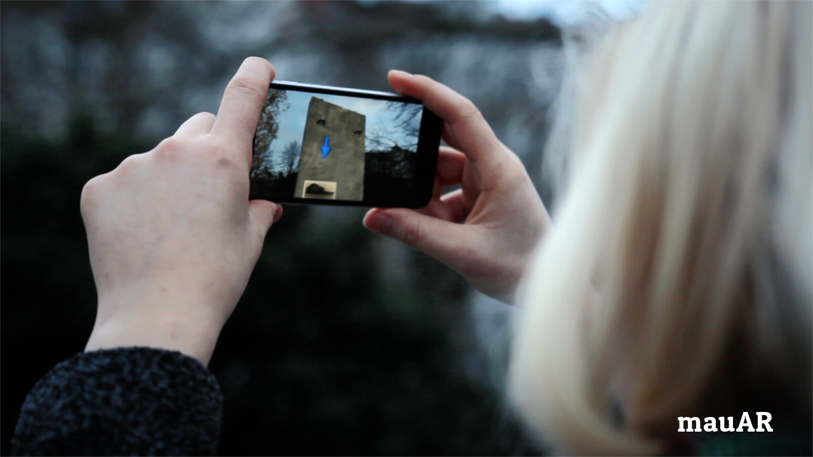

# [Berliner MauAR](http://mauar.de)
Die Vision unseres Projektes ist es, Fotos und Texte der ["Stiftung Berliner Mauer"](http://www.mauer-fotos.de) erlebbar zu machen. Dafür haben wir eine mobile App geschrieben, welche durch Augmented Reality, GPS Lokalisierung und Cloud Anbindung zum einen die Berliner Mauer wieder an den original Orten erscheinen läßt und dazu die offenen Bilder der Stiftung herunterläd und sie dort im freien Feld positioniert, wo sie geschossen wurden. So ist es möglich die damalige Stimmung einzufangen. Man kann die Berliner Mauer vor sich sehen, um sie herumlaufen. An den Bildern sehen, wie es aussah und wie es jetzt mit Mauer aussehen würde. Die Texte zu den Bildern geben dann einen tieferen Einblick in die Geschichte Berlins.
Berlin wall rebuild: Augmented Reality App for iOS

Das Projekt wurde im Rahmen von [Coding Da Vinci](https://codingdavinci.de) erstellt. Vielen Dank für die Möglichkeit und Unterstützung.

Website: [mauAR.berlin](http://mauar.berlin)

# Runs on iPhone & iPad
All models with the A9 processor and up:

- iPhone SE, 6s, 6s Plus, 7, 7 Plus, 8, 8 Plus, iPhone X
- "The iPad" (2017)
- iPad Pro 12.9" (2017), iPad Pro 10.5", iPad Pro 12.9" (2015)

# Teilnehmer
- [Peter Kolski](https://github.com/BildPeter) - App Entwicklung
- [Jörg Reichert](https://github.com/orgs/BerlinerMauAR/people/joergreichert) - Backend Entwicklung
- Maimi von Mirbach - Design UI / UX
- [Gottfried von Recum](https://github.com/orgs/BerlinerMauAR/people/GvRecum)
